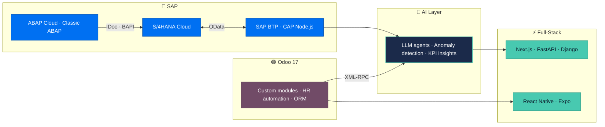

<div align="center">


<a href="https://github.com/Zouguari">
  
</a>

<br/>

[](https://linkedin.com/in/yassine-zouguari)
[](mailto:Yassine.zouguari.123@gmail.com)
[](https://www.credly.com/earner/earned/badge/31cdc2c5-0920-401b-b627-504b15beedc8)

</div>

```text
┃ SAP Easy Access ─ User: ZOUGUARI_Y ─ Client: 400
┃
┃ ▶ Command field : /nZYASSINE
┃ ✔ Transaction ZYASSINE started — navigate below, the SAP way.
```

> 🧭 **Navigation tip:** every section of this profile is a real SAP transaction code. If you know them, you already know where to look.

<br/>

## 👤 `/nSU01` — User Profile

```abap
CLASS zcl_yassine_zouguari DEFINITION PUBLIC FINAL CREATE PUBLIC.
  PUBLIC SECTION.
    INTERFACES if_oo_adt_classrun.
ENDCLASS.

CLASS zcl_yassine_zouguari IMPLEMENTATION.
  METHOD if_oo_adt_classrun~main.
    out->write( |Role    : Engineering student — IS Management & Governance (5th year)| ).
    out->write( |School  : ENSIASD Taroudant · Ibn Zohr University| ).
    out->write( |Mission : Technical ERP consultant — SAP & Odoo, powered by AI| ).
    out->write( |Builds  : BTP/CAP extensions · ABAP interfaces · Odoo modules| ).
    out->write( |Also    : Full-stack Python & Java · DevOps · Cloud| ).
    out->write( |Speaks  : Arabic (native) · French (B2) · English (B2)| ).
    out->write( |Looking : End-of-studies internship (PFE) — 2027| ).
  ENDMETHOD.
ENDCLASS.
```

<br/>

## 🗺️ The Bridge — where ERP meets AI

I don't treat SAP, Odoo, AI and web development as separate worlds. My work sits **in between** them:



**Principle I build by:** AI suggests, the ERP decides. Real business data is never altered cosmetically, and every AI-recommended action stays pending until a human confirms it in the ERP.

<br/>

## 🔐 `/nPFCG` — Roles & Authorizations *(Certifications)*

<div align="center">

| | Certification | Code | Verify |
|:-:|:--|:-:|:-:|
|  | **SAP Certified — Back-End Developer — ABAP Cloud** | `C_ABAPD_2601` | [](https://www.credly.com/earner/earned/badge/31cdc2c5-0920-401b-b627-504b15beedc8) |
|  | **SAP Certified — Backend Developer — SAP Cloud Application Programming Model** | `C_CPE` | [](https://www.credly.com/earner/earned/badge/4bab003b-e9b4-4c64-8c0c-d9b78fbc531c) |
|  | **Oracle Certified Professional: Java SE 17 Developer** | `1Z0-829` | [](https://catalog-education.oracle.com/ords/certview/sharebadge?id=B83791B2AC31E947924EA51F0BB8AF1C8385662DD7CC0E2768E5AE9ABD579BE9) |
|  | **Programming with Python 3.X** — Simplilearn | `2026` | — |

</div>

<!-- TODO: add the 2 other Java certifications here (same row format) -->

<br/>

## 📦 `/nSE80` — Object Navigator *(Featured Projects)*

### 🔷 SAP Track

| Project | What it does | Stack |
|:--|:--|:--|
| **[Vendor Spend Intelligence](https://github.com/Zouguari/vendor-spend-intelligence)** | Side-by-side SAP BTP extension connected to **S/4HANA Cloud** that uses AI to detect blocked and duplicate vendors. | `SAP BTP` `CAP Node.js` `CDS` `OData` `AI` |
| **[SAP ABAP IDoc — Sales Orders](https://github.com/Zouguari/sap-abap-idoc-sales-orders)** | End-to-end inbound interface in **Classic ABAP**: custom IDoc type & segments, inbound function module, BAPI order creation, log table, and an ALV monitor with one-click reprocessing of failed IDocs. Exported with abapGit. | `ABAP` `IDoc / ALE` `BAPI` `ALV` `abapGit` |
| **[CAP Purchase Request](https://github.com/Zouguari/cap-purchase-request)** | Purchase request application built with the SAP Cloud Application Programming Model, with an AI analysis layer. | `CAP Node.js` `CDS` `AI` |
| **[SAP Purchase Request](https://github.com/Zouguari/Sap_purchase_request)** | Purchase request scenario on SAP. | `SAP` |

### 🟣 Odoo Track

| Project | What it does | Stack |
|:--|:--|:--|
| **[SmartERP AI](https://github.com/Zouguari/smarterp-ai)** | SaaS decision-analytics platform and AI agent for **Odoo 17**: KPI analysis, anomaly detection and recommendations for SME managers, with audit trails and human-confirmed ERP actions. | `Odoo 17` `XML-RPC` `FastAPI` `Next.js` `LLM` |
| **[Smart HR Mobile](https://github.com/Zouguari/smart-hr-mobile)** | Mobile HR app connected to an Odoo backend. | `React Native` `Expo` `TypeScript` `Odoo` |
| **[HR Automation — Odoo](https://github.com/Zouguari/Rh_automatise-odoo)** | Automated HR modules in Odoo, configured to user needs. | `Odoo` `Python` |
| **[ENSIASD ERP](https://github.com/Zouguari/ENSIASD-ERP---Syst-me-de-Gestion-Int-gr-)** | Full academic ERP for ENSIASD: students, grades, attendance, internships and dashboards. | `Odoo 17` `Python` `PostgreSQL` `Docker` |
| **[WEBEDU — Student Portal](https://github.com/Zouguari/WEBEDUapplicationERP)** | Web application exposing student grades and information through the Odoo ERP API. | `Django` `REST API` `Odoo` |

<br/>

## 📋 `/nSM37` — Job Overview *(Experience)*

| Job name | Status | Highlights |
|:--|:-:|:--|
| `Z_URIKACLOUD_AI_ERP` · **AI & ERP Intern**, UrikaCloud · May–Aug 2026 | ✅ Finished | Built SmartERP AI, Smart HR Mobile and an AI recruitment module on top of Odoo 17. |
| `Z_LAFARGEHOLCIM_CV` · **AI Engineer Intern**, LafargeHolcim | ✅ Finished | Real-time face-recognition attendance system with a web dashboard. |
| `Z_CAR_RENTAL_WEB` · **Full-Stack Intern** | ✅ Finished | Car rental platform: reservations, vehicle catalogue, users and authentication. |
| `Z_MAROCARTISAN_LEAD` · **Global Project Lead** | ✅ Finished | Coordinated **10 teams (55 students)** on a Moroccan artisan marketplace; owned the Oracle DB architecture, code reviews and CI workflows. |

<br/>

## ⚙️ `/nSPRO` — Implementation Guide *(Tech Stack)*

**🔷 SAP**


**🟣 Odoo**


**🧠 AI & Data**

<a href="#"></a>


**⚡ Full-Stack — Languages & Frameworks**

<a href="#"></a>
<br/>
<a href="#"></a>
<br/>


**🗄️ Databases**

<a href="#"></a>


<br/>

## 🚚 `/nSTMS` — Transport Management *(DevOps & Cloud)*

```text
 DEV ──▶ Git / abapGit ──▶ GitHub Actions ──▶ Docker / Compose ──▶ AWS · SAP BTP
```

<a href="#"></a>


**Methods & governance:** Agile Scrum · Kanban · CI/CD · ITIL v4 · COBIT · CMMI · Microservices · REST APIs · Modular ERP design

<br/>

## 🟢 `/nSM50` — Work Processes *(Currently running)*

| WP | Status | Task |
|:-:|:-:|:--|
| `DIA 0` | 🟢 Running | Sharpening **Classic ABAP** on S/4HANA (interfaces, ALV, IDoc monitoring) |
| `DIA 1` | 🟢 Running | Evolving **Vendor Spend Intelligence** on SAP BTP |
| `BGD 0` | 🟡 Waiting | Looking for an **end-of-studies internship (PFE) 2027** — SAP · Odoo · AI |

<br/>

## 📈 `/nST03N` — Workload Analysis

<div align="center">


&nbsp;


</div>

<br/>

## 📬 `/nSBWP` — Business Workplace *(Contact)*

<div align="center">

**Working on SAP, Odoo or AI-for-ERP? Let's talk.**

[](mailto:Yassine.zouguari.123@gmail.com)
[](https://linkedin.com/in/yassine-zouguari)

</div>

```text
✔ Profile ZYASSINE saved successfully   │   Status: Open to PFE 2027   │   SAP · Odoo · AI · Full-Stack
```

<div align="center">

</div>
